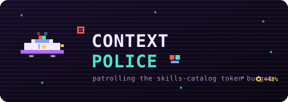

# 🚓 context-police

> A Claude Code skill that **audits and curates your skills catalog** — decide *what* belongs in the always-on catalog (real skills) and what doesn't (episodic lessons), apply the cut safely and reversibly, and **measure the result** with an interactive HTML recap. Claude Code now provides the trimming levers natively; this skill is the methodology for using them well.

[](https://github.com/wan-huiyan/context-police/releases)
[](LICENSE)
[](https://github.com/wan-huiyan/context-police/commits)
[](https://www.python.org/)
[](https://claude.com/claude-code)

<p align="center">
  
</p>

```
   ╔═══════════════════════════════════════════════╗
   ║  🚓  C O N T E X T   P O L I C E   🚨          ║
   ║  ▛▀▀▀▜  pull over — that catalog's over budget ║
   ║  ▙▄☆▄▟  -48%  🪙 saved/turn · ×N on fan-out    ║
   ╚═══════════════════════════════════════════════╝
```

---

## 🪙 What it is

Claude Code injects the **whole catalog of installed skills + agents into context on every turn** — and into **every subagent** you spin up. That's fine with a handful of skills. But if you run a [claudeception](https://github.com/anthropics/claude-code)-style learning loop that mints ~1 new skill per session, your `~/.claude/skills/` quietly balloons to **800+** entries... and *every single one* is force-loaded, forever, paid again on every fan-out.

The bill (measured on a real ~925-skill catalog): **~248k tokens** of skill descriptions per full injection — **~24× over a 1% context budget**. As of **v2.1.105** (2026-04-13; verify against your install with `/doctor`) Claude Code *enforces* that 1% budget natively (`skillListingBudgetFraction`): it collapses the least-used descriptions to bare names rather than pay the full bill, so ~248k is the *opt-in ceiling*, not the silent default (see ["Claude Code now does part of this natively"](#-claude-code-now-does-part-of-this-natively-as-of-v21105) below). It's still re-read every turn and multiplied across concurrent subagents, and small-context agent types (like `claude-code-guide`) can even overflow on launch with *"Prompt is too long" at 0 tokens.*

**context-police is the audit & curation toolkit for it.** The trimming levers themselves (`skillOverrides`, `disable-model-invocation`, the listing budget) are now native Claude Code features — the durable value here is deciding **what** to trim (episodic lessons vs real skills), applying it safely, and measuring the outcome:

1. 📏 **Measure** the real per-turn / per-subagent cost (from the cached-prefix token floor).
2. ✂️ **Trim** it — per-project with the verified `skillOverrides` lever, or globally with `disable-model-invocation: true` — **without deleting a single skill** (everything stays on disk + `/name`-invocable).
3. 📊 **Report** it — emit a self-contained, clickable **HTML recap** of exactly what got hidden and why.
4. 🧠 **Fix the root cause** — recognize that most of the bloat is *episodic lessons mis-stored as force-loaded skills*, then **curate them out of the always-on catalog** with `disable-model-invocation` (triaged by *description intent*, not name shape). A tempting alternative — surfacing the hidden lessons via an on-demand **retrieval hook** instead of force-loading — was tested to ground and **killed** (a base-rate wall: precision-when-firing <0.3% for both keyword *and* embedding retrievers). The curation flip pays regardless; the hook does not.

It's **allow-by-default** the whole way down: a skill is only ever hidden when it's clearly irrelevant to your current work, and every move is reversible.

---

## 🆕 Claude Code now does part of this natively (as of v2.1.105)

Good news, not bad: **Claude Code shipped a native version of this skill's core thesis** — in **v2.1.105 (released 2026-04-13)**. Version and defaults below are as of that release — **verify against your install with `/doctor`** (its **Skills** check shows the live values). Two settings do the work:

| Setting | Default (as of v2.1.105) | What it does |
|---|---|---|
| `skillListingBudgetFraction` | `0.01` (1%) | Caps the catalog at ~1% of the context window. When it's over budget, the **least-used** skills' descriptions collapse to bare names — still `/name`- and model-invocable, Claude just can't see *why* to reach for them. |
| `skillListingMaxDescChars` | `1536` | Per-skill cap on `description` + `whenToUse` (joined with `" - "`); anything longer is truncated **mid-word**, silently killing any trigger phrase past the cut. This is `/doctor`'s *"N descriptions exceed the per-entry cap"* line — gate it at publish time with [`check_skill_descriptions.py`](#-the-description-cap-gate). |

So `/doctor` now tells you something like *"563 skill descriptions will be dropped (10.8%/1% of context)… opting in would cost ~111k tokens every session."* Read it right:

- **That warning is the budget protecting you — it's context-police running automatically.** The ~111k is the bill you'd pay *if you opted in* to full descriptions; the 1% default silently absorbs it.
- **⚠️ Do NOT "fix" the warning by raising `skillListingBudgetFraction`.** That's the anti-pattern — it pays the ~111k every turn and burns rate limits faster. (That figure is in the **same ballpark** as this skill's earlier ~122k full-description estimate — measured on the current, already-trimmed catalog, so consistent rather than an exact match.)
- **The aligned fix is the opposite: shrink the catalog so the budget drops *irrelevant* skills, not useful ones** — exactly what this skill's `disable-model-invocation` sweep + per-project `"off"` do. `/doctor`'s drop-count is what *remains after* those levers fire.

The native budget makes context-police **more** useful, not less: `/doctor` is now the canonical readout for the cost this skill was built to measure, and the skill tells you which lever actually helps versus the one that backfires.

---

## 🌐 Works across harnesses (the problem is portable, the levers differ)

The catalog-bloat **problem** and the curation **methodology** aren't Claude-specific — the [Agent Skills open standard](https://agentskills.io) (`SKILL.md`) is shared by Claude Code, Cursor, Codex, Copilot CLI, and Gemini CLI. The always-on *listing* of skill names+descriptions scales with N on all of them; what differs is whether the harness has a **native budget** to bound it (researched 2026-06-17):

| Harness | Native listing budget? | Per-skill disable (keep manually-invocable) | Sub-agent ×N? |
|---|---|---|---|
| **Claude Code** | ✅ `skillListingBudgetFraction` 1% + `skillListingMaxDescChars` 1536 (defaults as of v2.1.105 — `/doctor` shows yours) | `skillOverrides`, `disable-model-invocation` | yes |
| **Codex** | ✅ ~2% / 8 000-char cap (descriptions shorten, then omit-with-warning) | `allow_implicit_invocation:false` / `enabled=false` | yes |
| **Cursor 2.4** | ❌ none documented | **`disable-model-invocation: true`** + `paths` glob | unverified |
| **Copilot CLI** | ❌ none | `disable-model-invocation` / `user-invocable:false` + `/skills` | **no** (sub-agents inherit no skills) |
| **Gemini CLI** | ❌ none | `/skills disable` + `@`-invoke | unverified |

**So:** on Claude Code and Codex the budget bounds the cost automatically; on **Cursor, Copilot CLI, and Gemini CLI there's no documented budget — context-police's manual curation is still the live answer.** And `disable-model-invocation` is part of the standard, so it works **verbatim on Cursor and Copilot CLI**, not only Claude Code. See the skill's *"Porting to another harness"* section for the recipe.

---

## 🕹️ Quick Start

Just describe the symptom and Claude reaches for the skill:

```
You: my subagents are dying with "Prompt is too long" and I have like 800 skills installed.

Claude: [reads context-police] That's the force-loaded catalog. Let me first probe whether it's a
        universal overflow or just one small-context agent type, then I'll measure the cost and draft
        a per-project skillOverrides denylist (allow-by-default, fully reversible) you can review.

You: do it for this project.

Claude: [picks domain-irrelevant skills — bio DBs, cloud one-offs, single-incident traps that can
        never match this stack — sets them "off" in .claude/settings.json, protects your real stack,
        then renders an interactive HTML recap of every decision] Restart CC and the catalog shrinks.
```

The lever is a plain map in your **project's** `.claude/settings.json`:

```jsonc
{
  "skillOverrides": {
    "alphafold-database": "off",      // bio DB — irrelevant to a web app
    "scanpy": "off",                  // single-cell genomics — irrelevant
    "some-one-off-flask-trap": "off", // single-incident lesson, not a reusable skill
    "react-router-v7-migration": "on" // PROTECT: this is your real stack
  }
}
```

`"off"` drops the skill from the model-invocable catalog (reclaims its tokens) — the `SKILL.md` is untouched and still `/name`-invocable. Set it back to `"on"` (or delete the entry) to undo. **Takes effect on the next Claude Code restart.**

---

## 📦 Installation

**Git clone (always works):**

```bash
git clone https://github.com/wan-huiyan/context-police.git ~/.claude/skills/context-police
```

**Claude Code plugin (marketplace):**

```bash
/plugin marketplace add wan-huiyan/context-police
/plugin install context-police@wan-huiyan-context-police
```

Either way, restart Claude Code so the skill is picked up.

---

## ✨ Without vs With

| | 🙀 Without context-police | 😺 With context-police |
|---|---|---|
| **Catalog cost** | CC's 1% budget silently collapses ~half your descriptions to bare names — you don't see which, or what the ~100k+/turn opt-in bill is | Measured via `/doctor` + the cached-prefix floor; catalog trimmed ~48% per-project so the budget drops *irrelevant* skills, not useful ones; the `×N` fan-out multiplier made explicit |
| **Small subagents** | `claude-code-guide` overflows: *"Prompt is too long" at 0 tokens* | Probe → it's *that agent type's* window, not a universal break; trim the noise |
| **Cutting noise** | Delete skills (lossy, irreversible) or `enabledPlugins` per-project (footgun — replace-semantics nukes everything you didn't relist) | `skillOverrides` per-project (scoped, reversible) — nothing deleted, all still `/name`-invocable |
| **Knowing what changed** | A diff of a settings file nobody reads | A clickable, searchable **HTML recap** of every skill by decision + reviewer reason |
| **The real problem** | Catalog keeps growing ~1 skill/session, forever | Recognized: most bloat is *lessons*, not *skills* → curate them out of the catalog by description intent (a retrieval-hook replacement was tested and killed) |

The "Without" column isn't a strawman — `enabledPlugins` per-project and bulk-deleting really are the obvious-but-wrong moves; this skill documents *why* and what to do instead.

---

## 🛠️ What you get

- **The verified levers, with the gotchas spelled out:**
  - `skillOverrides` (per-project, in `.claude/settings.json`) — the right tool for scoping noise to one project. **Not** `enabledPlugins` per-project (settings precedence: project *replaces* user, so it would disable every plugin you didn't relist).
  - `disable-model-invocation: true` (SKILL.md frontmatter) — the verified **global** lever: drops a skill's *name* from the catalog (reclaims the full per-skill cost) while keeping it `/name`-invocable + `rg`-reachable.
  - Two corrections to the naive plan: `"name-only"` only reclaims tokens for a skill the native budget is *still showing with a description* (a most-used one) — the least-used tail is already collapsed to bare names, so for them it's a **no-op**; only `"off"` reclaims the *name*. And `find-skills`/`search-skill` search **external** marketplaces only — they do **not** re-surface your hidden local skills.
- **A safe wide-denylist method** (the conservative cut → ~48%): anchored `startswith` matching (never substring — `"ml-"` would eat `html-...`), an explicit PROTECT allowlist for your real stack, a review-panel vetting that keeps **ON** anything *any* reviewer flags (union, not intersection — because a wrongly-hidden relevant skill is the only harm).
- **A publish-time description-cap gate** (`scripts/check_skill_descriptions.py`) — the upstream half: stop an oversized description from shipping at all. Zero-dependency, exit 1 on violation, drop it in CI. See below.
- **An interactive HTML recap** (`scripts/render_treatment_report.py`) — arcade-styled, self-contained, opens from `file://`, with clickable tiles → a searchable explorer of every skill by decision (off / on / kept / added / override + reason).
- **The durable root-cause analysis** — why the bloat is a knowledge base in the wrong substrate, the *two distinct strategies* that follow (curation vs retrieval-hook-replacement), and the measured reason only one of them works.

---

## 🚧 The description-cap gate

Everything else here curates a catalog you **inherited**. This is the upstream half — keep an oversized
description from shipping in the first place.

```bash
python3 scripts/check_skill_descriptions.py .              # gate a skill repo (exit 1 on violation)
python3 scripts/check_skill_descriptions.py . --triggers   # what truncation is destroying
python3 scripts/check_skill_descriptions.py . --context 1000000 --json
```

**Going over the cap doesn't cost tokens — the budget is a hard cap. It costs *descriptions*.** And truncation
isn't intelligent: the harness keeps `full[:1535]` and appends an ellipsis. A description **is** trigger text,
so every `when the user says "…"` phrase past that character position is **already dead** — the skill won't
fire on it, and nothing reports the loss.

That inverts the usual worry. The instinct is *"if I trim the description, will the skill still work?"* — but
an over-cap description is **already trimmed**. The only question is whether *you* choose what survives, or the
harness chooses by character position. `--triggers` lists the phrases past the cut, so a deliberate trim is
verifiable: re-run until that section is empty.

Measured on a real 18-plugin install (2026-08-04): **12 skills over cap, 30 trigger phrases invisible.** One
skill had lost all 11 triggers for an entire documented feature — `"budget mode"`, `"cheap review"`,
`"token-efficient review"` and the rest — so a fully-documented feature couldn't be invoked by any of its own
trigger phrases.

> **Not a body-size check.** The body lazy-loads only when the skill fires; the description is resident every
> turn. A 1,620-char description with a tiny body passes a body-size linter and fails here; the reverse also
> holds. Independent checks — run both.

In CI:

```yaml
- run: python3 scripts/check_skill_descriptions.py . --no-color
```

Exit `0` clean · `1` over cap · `2` bad path (so a typo fails loudly instead of passing as a no-op).

---

## 📊 The interactive recap

After you apply a treatment, render a clickable HTML report of exactly what happened:

```bash
python3 ~/.claude/skills/context-police/scripts/render_treatment_report.py \
  --settings .claude/settings.json \
  --skills-dir ~/.claude/skills \
  --decisions panel-decisions.json \
  --title "My Project" \
  --out skill-treatment.html
```

- Data-driven & honest-by-construction: it reads the OFF set straight from your `settings.json`, enumerates the skills universe, and computes the bare-name token estimate (`Σ(len(name)+3)/4`, paid every turn + per subagent).
- The `--decisions` file is optional (`{"pulls":[…],"adds":[…],"override":[…]}`); omit it for a plain off/on drill-down, pass it to surface the review-panel reasons.
- All data is inlined — no server, no build. On macOS, `open skill-treatment.html`.

---

## 🧠 The durable fix (two strategies — keep them separate)

`skillOverrides` is a per-project **symptom** fix. The real growth driver is that the mint loop adds ~1 skill/session and force-loads them all forever — and **most of those are episodic lessons** (single-incident gotchas like `flask-flash-silently-dropped-without-base-render`). Those aren't skills; they're **lessons**, and lessons belong in a *searchable archive surfaced on demand* — not the always-loaded catalog. Two strategies follow from that, and conflating them is the trap:

**1. Curation — the real, measured win (and it's now executed).** Flip the episodic *traps* to `disable-model-invocation: true`: they leave the always-on catalog (reclaiming tokens) while staying `/name`-invocable and `rg`-reachable. This pays *regardless of any retrieval mechanism*. The one prerequisite is **a correct trap/procedure classifier — by description *intent*, not name shape.** A hyphen-count heuristic mislabeled **171/886 skills**: name-invoked *procedures* (`auto-review-loop`, a feature-evaluator) that would be wrongly hidden, and genuine reactive *traps* kept force-loaded forever because of name markers like `worktree`/`handoff`. The discriminator: *does the agent go looking for it by name (procedure → keep) or does it only help if surfaced reactively to warn of a mistake (trap → curation candidate)?* On a real ~886-skill catalog this curated to 434 traps / 452 procedures, and **404 traps were flipped** — after a *blind second-rater + 2-of-3 majority tie-break* rescued **33** mislabeled procedures from the hide-list (the dangerous direction is a useful playbook mislabeled as a trap).

**2. Retrieval-hook-as-replacement — tested to ground, killed.** The appealing alternative was a **two-trigger retrieval hook** (`UserPromptSubmit` + `PostToolUse`) that indexes the `SKILL.md` corpus in place and injects only the top-K relevant traps as `additionalContext` — letting you hide traps *"safely"* because the hook would surface them when needed. **It can't.** A keyword score floor fires on **~99.6% of all turns** at any threshold, and every specificity gate (distinctive-token count, IDF-sum, score margin, distinctive-coverage) fails the same way. The load-bearing reason is a **base-rate wall**: genuine-trap moments are **~0.1% of all triggers**, so even a *perfect* gate would fire ≤0.1% of the time — making precision-when-firing **<0.3%, ~99.7% noise** at the strictest setting. **Embeddings — the one untested precision lever — were then tested and fail identically** (semantic cosine over `user_prompt`: ~23% recall at ~99% firing; best realized precision ≈0.4%). It's arithmetic, not embedder quality. So the shadow hook was **removed**, and the lever is curation (Strategy 1) plus the agent's own *grep-lessons-on-task-start* discipline.

Don't sell *"the hook makes it safe to hide traps"* — that claim is false. Hiding traps is a curation cost/benefit call decided on **catalog-cost** grounds, not a recall gain.

---

## ⚖️ Limitations & honesty

This skill leans **cautious**, on purpose. The honest caveats:

- **Allow-by-default → the only failure mode is a wrongly-hidden *relevant* skill.** A missed cut is just unrealized savings (harmless); an over-eager cut hides something you wanted. That asymmetry is why the wide-denylist method uses a PROTECT allowlist and a union-not-intersection review panel. It still isn't zero-risk — review the OFF set.
- **The global `disable-model-invocation` lever rests on an *unmeasured* premise.** Hiding a skill's name assumes bare-name auto-recall is *already marginal at scale* — that's docs-derived reasoning, **not** a measured counterfactual (every transcript ever recorded had force-load ON). Treat the global mass-hide as a tradeoff (measured *benefit*: ~4.9k bare-name → ~122k full-desc tokens/injection — in the same ballpark as `/doctor`'s reported ~111k to opt back into full descriptions (measured on the current, already-trimmed catalog) — every turn × every subagent × every project; unmeasured *cost*: passive name-recognition), not a slam dunk. The flip is a cost/benefit call **you** own.
- **The retrieval-hook replacement was tested and KILLED — don't expect it to make hiding "safe".** A keyword score floor fires on **~99.6% of all turns**, and every specificity gate (distinctive-token count, IDF-sum, score margin, coverage) hits the same **base-rate wall**: genuine-trap moments are ~0.1% of triggers, so precision-when-firing is **<0.3%**. **Embeddings fail identically** (~23% recall at ~99% firing). It's arithmetic, not a tuning gap — so the shadow hook was removed and curation is the only lever. Two real prerequisites *do* gate curation: fix the classifier **by description intent** (a hyphen-count heuristic mislabeled 171/886 skills), and **independently re-rate a single-rater hide-list before any destructive sweep** (a blind second-rater + tie-break rescued 33 procedures wrongly marked as traps).
- **Don't blow away an existing relevance-curated `skillOverrides` when you add the global flip.** They hide *different* things: the global flag hides *traps everywhere* (keeps `/name`); a per-project `skillOverrides` "off" map is usually a *relevance* hide (bio/research skills irrelevant to this repo) that intent labels can't reconstruct. Surgical merge: `new_off = old_off − (globally-flipped traps) − (rescued procedures)`.
- **`"name-only"` is a no-op for any standalone skill the native budget has *already* collapsed to a bare name** (the least-used tail) — it only reclaims tokens for the most-used skills still showing a description; and `find-skills`/`search-skill` won't resurface your hidden local skills. Don't rely on either as a safety net.
- **It can't read minds about *your* stack.** The denylist is a draft for *you* to review, not an auto-apply.
- **Takes effect on restart** — the catalog is injected at session start.

No overclaiming: the symptom fix (`skillOverrides`) is solid and reversible; the root-cause fix is **curation** (now measured *and* executed — 404 traps flipped), and the retrieval-hook idea that once looked like the answer is honestly reported as tested-and-dead.

---

## 🔧 Dependencies

| Dependency | Required? | Without it |
|---|---|---|
| Claude Code | ✅ required | n/a — this is a CC skill |
| `python3` (3.8+) | optional | the levers + method still work by hand; you just can't render the HTML recap |
| `rg` / standard CLI | optional | used for verifying a hidden skill is still reachable |

No third-party Python packages — the recap script is stdlib-only.

### 🔁 Maintaining the plugin copy

The skill ships twice: the repo root (`SKILL.md` + `scripts/`) is the **source of truth**, and `plugins/context-police/skills/context-police/` is a byte-identical copy for the plugin marketplace. Don't edit the plugin copy directly — edit the root, then sync:

```bash
scripts/dev/sync_plugin_copy.sh          # copy root SKILL.md + scripts/ into the plugin
scripts/dev/sync_plugin_copy.sh --check  # verify only; exits non-zero on drift
```

CI (`npm test`, zero-dependency `node --test`) fails if the copies drift or the manifests disagree. `scripts/dev/` is dev tooling and is excluded from the plugin copy.

<details>
<summary><b>✅ Quality checklist — what this skill guarantees</b></summary>

- Every lever is **verified** against `code.claude.com/docs` (the settings-precedence + `disable-model-invocation` behavior was empirically confirmed, not assumed).
- The denylist method is **allow-by-default and reversible** — nothing is deleted; entries flip back to `"on"`.
- The HTML recap is **honest-by-construction** — numbers are computed from your actual `settings.json` + skills dir, not hand-entered.
- The root-cause curation is gated on a **fixed-by-intent classifier** + an **independent re-rate of the hide-list** — the skill asks for both before any destructive sweep.
- Tradeoffs (unmeasured global-hide premise, the tested-and-killed retrieval hook) are stated up front, not buried.
</details>

---

## 🧰 Related tools

- **[token-torch](https://github.com/wan-huiyan/token-torch)** — usage dashboard that **quantifies the savings this tool produces**: its "Catalog savings" panel reads the `disable-model-invocation` output directly.
- **[memory-hygiene](https://github.com/wan-huiyan/memory-hygiene)** — the right **substrate for the episodic lessons** this tool evicts from the always-on catalog.
- **[claude-ecosystem-hygiene](https://github.com/wan-huiyan/claude-ecosystem-hygiene)** — the **bundle** that distributes context-police alongside its sibling hygiene tools.

---

## 🤝 Related skills

- **`concurrent-session-curating-shared-global-dir`** — the shared `~/.claude/skills/` dir grows *live* across parallel sessions.
- **`claude-code-subagent-agenttype-overrides-session-model`** — a different subagent-context gotcha (a workflow `agentType` silently pins a cheap model).
- **[claudeception](https://claude.com/claude-code)** — the skill-minting loop that *causes* the bloat in the first place (this skill is its cleanup crew).

---

## 📜 Version history

- **v2.1.0** — **the publish-time description-cap gate** (`scripts/check_skill_descriptions.py`). Adds the upstream half: measure `description` + `whenToUse` against `skillListingMaxDescChars` (1536) and fail CI before an oversized description ships. The finding that motivated it: **truncation silently kills trigger phrases** — the harness keeps `full[:1535]` and drops the rest, so any `"…"` trigger past that position can never fire. Measured on a real 18-plugin install: 12 skills over cap, **30 trigger phrases invisible**, one skill having lost all 11 triggers for a fully-documented feature. `--triggers` names them, which makes a deliberate trim *verifiable* rather than a leap of faith. Also **corrects the setting's name throughout** — it is `skillListingMaxDescChars`, not `maxSkillDescriptionChars` (no `settings.json` key matches the latter; verified against the v2.1.221 binary).
- **v2.0.0** — **harness-agnostic reframe.** Led with the portable problem + curation methodology, demoted the Claude Code levers to a clearly-labeled *implementation* section, added a researched **cross-harness landscape** (Cursor / Codex / Copilot CLI / Gemini CLI — who has a native budget, who still needs manual curation; `disable-model-invocation` is part of the open standard and works verbatim on Cursor + Copilot CLI) and a **"porting to another harness"** recipe, and folded the retrieval-hook / 122k / forward-sweep work into a compact **History** footnote. Net: as a Claude-Code "fix the cost" tool the native budget made ~half of it redundant; reframed as *"manage skill-catalog cost in any auto-minting harness,"* its durable relevance is broader.
- **v1.10.0** — **the `disable-model-invocation` dual-role + reverse-audit lesson.** The flag is *also* the **correct** config for a user slash-command (it stops the *model* auto-firing `/changelog`, `/lfg`, `/setup`… while keeping `/name`) — not just a trap-hide. So a reverse audit that flags "name-invoked → restore" is a **false-positive machine**: a full body-read audit of all 487 hidden skills flagged 17 "wrongly hidden," but on a deterministic `argument-hint`/`allowed-tools` check ~16 were correctly-configured commands (restoring them would let the model auto-fire commands *and* re-bloat the catalog). Genuine restores ≈ 1. Also: a conservative re-rated **forward** extension confirmed **0** new safe traps — post-budget the hide-sweep is largely played out; the remaining value is reading `/doctor` right, the per-project `off` lever, and *not over-hiding*. Added classification-rigor rules (intent-not-name, blind re-rate, deterministic-over-LLM).
- **v1.9.0** — **Claude Code shipped the native catalog budget** (`skillListingBudgetFraction` 1% + `skillListingMaxDescChars` 1536, surfaced by `/doctor`) in **v2.1.105 (2026-04-13)** — ~7 weeks *before* this skill was first written; the original "docs-derived, not measured" note was about this exact mechanism, now verified. Documented it, made `/doctor` the canonical readout, flagged **raising the budget fraction as the anti-pattern** (its ~111k opt-in cost is consistent with — same ballpark as — the old ~122k estimate), and **corrected two now-false claims** — *"standalone skills inject as bare names"* and *"`name-only` is a blanket no-op"* — which only held before the budget made description-dropping usage-ranked.
- **v1.7.0** — the root-cause work resolved: curation works, the retrieval-hook replacement doesn't.
  - **Separated the two strategies** (curation vs retrieval-hook-replacement) and fixed the trap/procedure classifier to triage by **description intent**, not hyphen count (171/886 mislabeled).
  - **Proved the keyword hook can't replace force-load** across five gate families — a **base-rate wall** (genuine-trap moments ~0.1% of triggers), precision-when-firing <0.3%. **Embeddings then tested and fail identically** (~23% recall @ ~99% firing). Shadow hook removed.
  - **Curation flip executed** — 404 traps `disable-model-invocation`d after a *blind second-rater + 2-of-3 tie-break* rescued 33 mislabeled procedures; claudeception mint-default flipped so new traps mint hidden. Added the "don't clobber a relevance-curated `skillOverrides`" merge rule.
- **v1.5.0** — root-cause arc: lessons-as-skills → recall-gated retrieval hook; shadow-mode recall@K findings (51% recall / 99.6% injection → not live-ready); S11 corrections (classifier mislabel, subagent leg, embeddings deferred).
- **v1.4.0** — renamed `skills-catalog-context-cost-skilloverrides-scoping` → `context-police`; added the interactive `render_treatment_report.py` recap.
- **v1.x** — the verified `skillOverrides` + `disable-model-invocation` levers, the precedence gotcha, the safe wide-denylist method, and the overhead-measurement recipe.

---

## 📄 License

[MIT](LICENSE) © Huiyan Wan

<sub>Built with 🪙 and a tiny pixel siren. Meow meow ~^.^~</sub>
